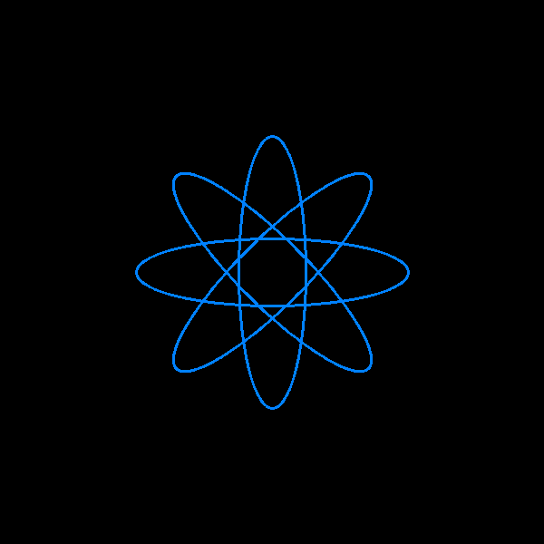

# PHP-OPENCV - PHP extension for Opencv

[](https://travis-ci.org/hihozhou/php-opencv) [](https://php.net/)

## Requirements

- OpenCV 3.2
- PHP7.0+


## Installation

```bash
git clone https://github.com/hihozhou/php-opencv.git
cd php-opencv
phpize
./configure --with-php-config=your php-config path
make
make install
```

## Configure

php.ini

```
extension="opencv.so path"
```
## Example

```php
//Obama.php
use function CV\{ imread, imshow, waitkey, namedWindow};

$im = imread('Obama.png');//load image
namedWindow('This is Obama id card',WINDOW_FULLSCREEN);//create window
imshow('This is Obama id card',$im);//show image on window

waitkey(0);

```

result:


Load image by gray

```php
$gray = imread('Obama.png',IMREAD_GRAYSCALE);
//or
use  function CV\{ cvtColor};
$gray = cvtColor($im, COLOR_BGR2GRAY);

```


You can draw something.  
e.g:  

```php
use CV\{Mat,Scalar, Point, Size};
use function CV\{ellipse, imwrite, waitKey};
use const CV\{CV_8UC3};

$windowWidth = 600;
$thickness = 2;
$lineType = 8;
$matScalar = new Scalar(0,0,0);
$mat = new Mat($windowWidth, $windowWidth, CV_8UC3, $matScalar);
$point=new Point($windowWidth/2, $windowWidth/2);
$size=new Size($windowWidth/4, $windowWidth/16);
$scalar=new Scalar(255, 129, 0);
for($i = 0; $i <= 360; $i += 45){
    ellipse($mat,$point,$size,$i,0,360,$scalar,$thickness,$lineType);
}
imwrite('./tests/ellipse.png',$mat);

```

result:




## Features
- 1.calib3d
- 2.contrib
- 3.core
- 4.imgproc
- 5.features2d
- 6.flann
- 7.gpu
- 8.highgui
- 9.legacy
- 10.ml
- 11.nonfree
- 12.objdetect
- 13.ocl
- 14.photo
- 15.stitching
- 16.superres
- 17.ts
- 18.video
- 19.Videostab

## Document

[PHP OpenCV Api](http://php-opencv.hihozhou.com/zh-cn/api/)

## Structure
- CV(namespace)
    - CONSTANTS
    - CLASSES 
        - Exception(class)
        - Mat(class)
            - properties
                - public int $rows
                - public int $cols
                - private int $type
            - functions
                - public __construct(int $rows, int $cols, int $type, Scalar $scalar)
                - public print(int $type)
                - public static zeros(int $rows, int $cols, int $type)
                - public type()
                - public depth()
                - public channels()
                - public isContinuous()
                - public row(int $y)
                - public col(int $x)
                - public clone()
        - Point(class)
            - properties
                - public int $x
                - public int $y
            - functions
                - public __construct(int $x, int $y)
                - public print()
        - Scalar(class)
            - public array $val
            - public __construct(int $val1, int $val2, int $val3, int $valu4)
            - public print()
        - Size(class)
            - functions
                - public __construct(int $width, int $height);
                - public print()
        - Rect(class)
            - functions
                - public  __construct(int $x, int $y, int $width, int $height)
                - public print()
                - pubilc tl()
                - public br()
                - public size()
                - public area()
        - Formatter(class)

    - FUNCTIONS
        - imread(string $path, int $flags = CV\IMREAD_COLOR)
        - imwrite(string $path, Mat $img)
        - namedWindow(string $name, int $flags = 2)
        - imshow(string $windowName, Mat $img)
        - waitKey(int $sec)
        - cvtColor(Mat $img, int $code)
        - ellipse(Mat $img, Point $center, Size $size, int $angle, int $startAngle, int $endAngle, Scalar $color, int $thickness = 1, int $lineType = CV\LINE_8, int $shift = 0)
        - circle(Mat $img, Point $center, int $radius, Scalar $color, int $thickness = 1, int $lineType = CV\LINE_8, int $shift = 0)
        - line(Mat $img, Point $start, Point $end, Scalar $color, int $thickness = 1, int $lineType = CV\LINE_8, int $shift = 0)
        - rectangle(Mat $img, int $startX, int $startY, int $endX, int $endY, Scalar $color, int $thickness = 1, int $lineType = CV\LINE_8, int $shift = 0)
        - rectangleByPoint(Mat $img, Point $start, Point $end, Scalar $color, int $thickness = 1, int $lineType = CV\LINE_8, int $shift = 0)
        - rectangleByRect(Mat $img, Rect $rect, Scalar $color, int $thickness = 1, int $lineType = CV\LINE_8, int $shift = 0)
    
    
    
## 感谢

感谢[韩天峰](https://github.com/matyhtf)老大的指导，  
感谢[盘古大叔](https://github.com/pangudashu)的[php7-internal](https://github.com/pangudashu/php7-internal)项目以及平常的指导，  
感谢`木桶技术升级交流群`和`黑夜路人技术群`、以及`PHP内核交流`的群友对技术的帮助。